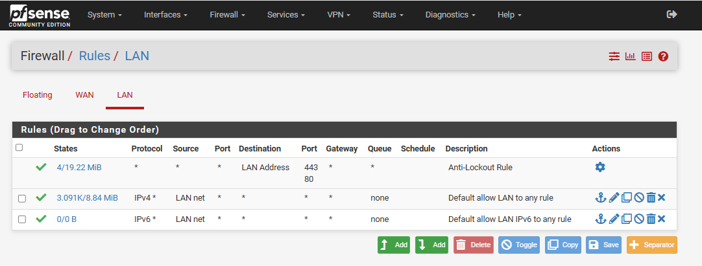
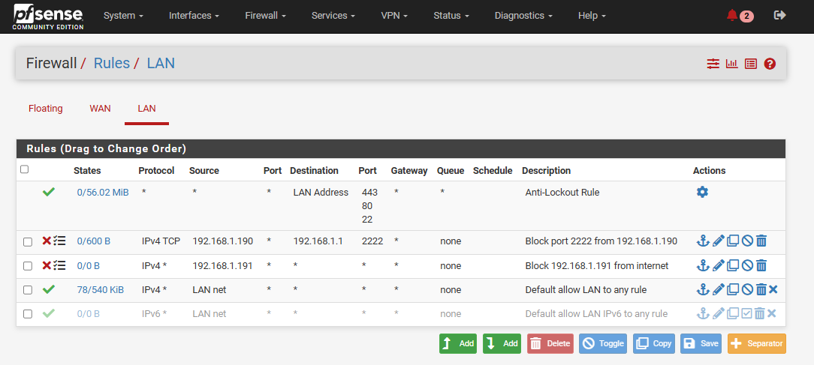

## Firewall Rules:

### WAN Firewall Rules in pfSense:

- **WAN rules control incoming traffic** from the internet to your pfSense firewall or internal network.
- **By default, pfSense blocks all unsolicited incoming WAN traffic** — it's a secure default.
- You must **explicitly allow traffic** (e.g., for port forwarding, VPN, remote SSH) through WAN rules.


#### Typical Use Case: Allow SSH on WAN:

1. Go to: `Firewall` → `Rules` → `WAN` - click `Add`: 
    - Action: Pass
    - Interface: WAN
    - Address Family: IPv4
    - Protocol:	TCP

    - Source: `any`	(Choose any, or a specific IP/subnet to limit access)
    - Source Port Range: N/A (**No need to port assign**)
    
    - Destination:	`WAN address` 
    - Destination Port Range: `SSH (22)`  (or any port you want to allow)
    - Description:	Allow WAN SSH or Port 22


#### Test It:

From an external host (not in the LAN):
```
ssh -p 22 your_user@pfSense_WAN_IP
```


---
---


### LAN Firewall Rules in pfSense:

- **LAN rules control outgoing traffic from LAN devices** (like your PCs, servers, etc.).
- **By default, pfSense allows all LAN traffic out to any destination** unless you create custom block or restrict rules.
- You can use LAN rules **to control, restrict, or block traffic from specific devices**, IPs, ports, or protocols.


_Here is default LAN rules:_




### Common LAN Rule Use Cases:

#### 1. Block a Single IP from Internet Access:

_Block 192.168.1.191 from accessing anything outside the LAN:_

Go to: `Firewall` → `Rules` → `LAN` - click `Add`: 
- Action: `Block`
- Interface: `LAN`
- Address Family: `IPv4`
- Protocol:	`Any`

- Source: **Single host or alias** → `192.168.1.191`	(or, choose specific IP/subnet to limit access)
    
- Destination: `any` 

- Description:	Block 192.168.1.190 from internet


#### 2. Block LAN Host from Specific IP or Port:

_Block 192.168.1.190 from connecting to 192.168.1.1 on port 2222:_

Go to: `Firewall` → `Rules` → `LAN` - click `Add`: 
- Action: `Block`
- Interface: `LAN`
- Address Family: `IPv4`
- Protocol:	`TCP`

- Source: **Single host or alias** → `192.168.1.190`	(or, choose specific IP/subnet to limit access)
    
- Destination:	**Single host or alias** → `192.168.1.1`
- Destination Port Range: `(other)` → `2222`

- Description: Block port 2222 from 192.168.1.190


_Here is custom LAN rules:_




