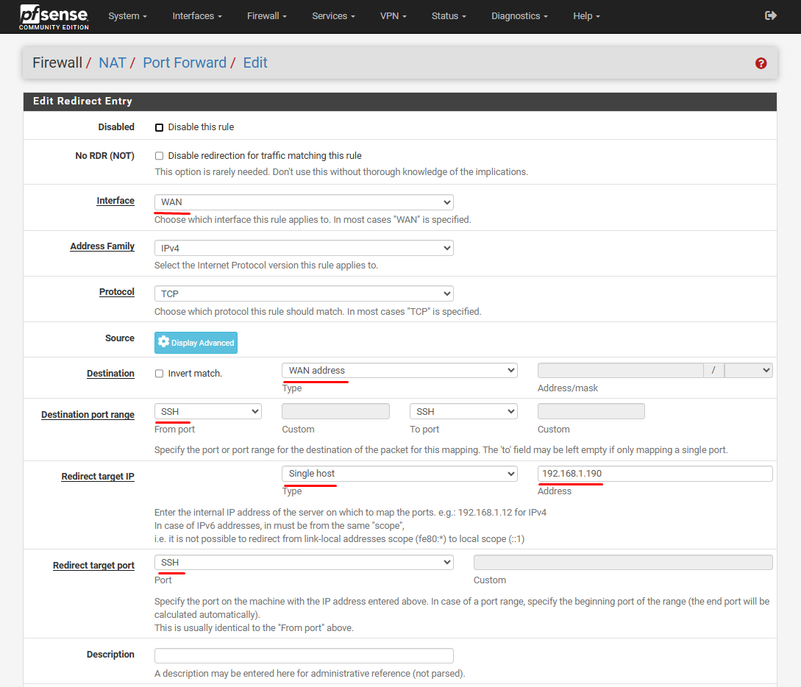
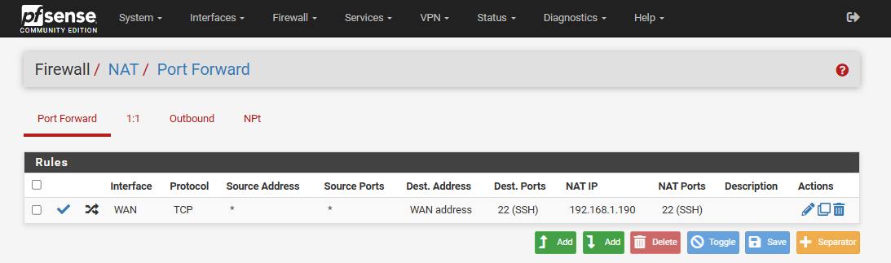
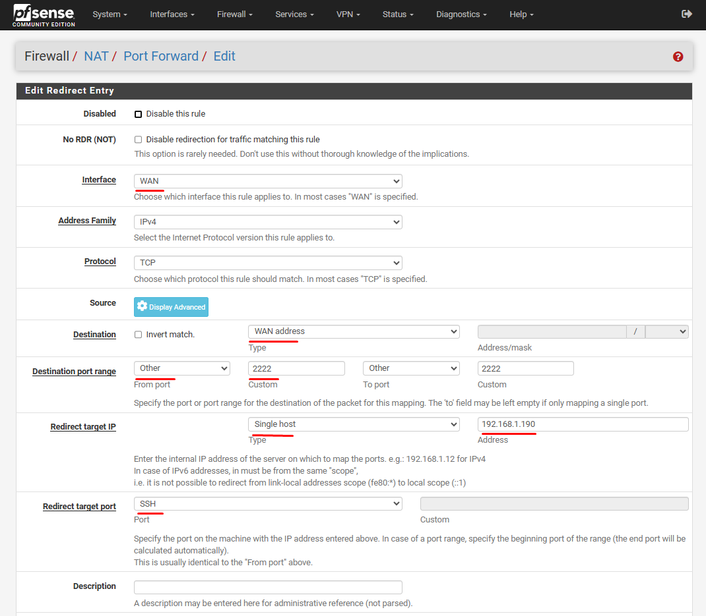
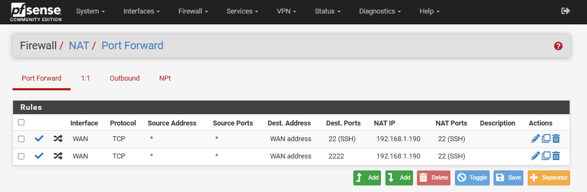

## Port Forwarding (WAN to LAN Port Forward):

Port forwarding is a type of inbound NAT which enables access to a specific port, port range, or protocol on an internal network device. Port forward rules rewrite the destination of a packet and then forward those packets to the new destination. This functionality is known by different names in various products, including “**Destination NAT**” or “**Inbound NAT**”.


When traffic comes from the WAN to your firewall's WAN IP, the firewall looks at the destination port (`dport`) to decide:

- Which internal (LAN) IP to forward the traffic to.
- Which internal port it should target.


### Scenario: Port Forward Rule for SSH (TCP/22):
- External IP: `10.1.1.128` (WAN IP)
- External Port: 22 or 2222 (WAN Port)
- Internal Server: `192.168.1.190` (LAN IP)
- Internal Service: SSH
- Internal Port: 22


#### Matching `dport`:
If you are forwarding SSH:
- Incoming packet:
    - Destination IP: `10.1.1.128`
    - Destination Port: `22` or `2222` → this is `dport`


### Example Use Case:

Navigate to `Firewall` > `NAT`, on the `Port Forward` tab - click `Add`:
- Interface: `WAN`
- Address Family: `IPv4`
- Protocol:	`TCP`

- Source: 
    
- Destination:	`WAN address`
- Destination Port Range: `SSH`

- Redirect target IP: **Single host** > `192.168.1.190`
- Redirect target port: SSH

- Description: Forward SSH from WAN 22


#### Port Forwarding rules: 










### Test Port Forwarding:

```
ssh -p 22 user_name@<pfSense-WAN-IP>

ssh -p 22 root@10.1.1.128
```
