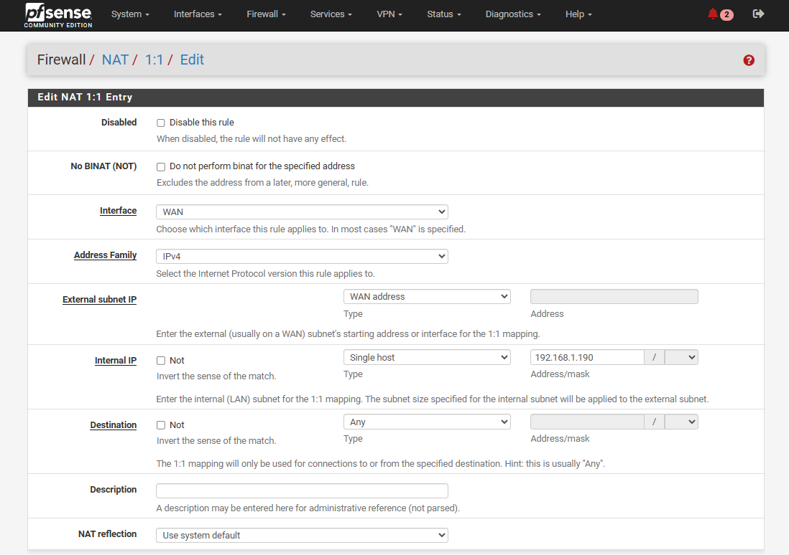

## NAT:

NAT (Network Address Translation) allows a firewall/router (like pfSense) to modify IP addresses and/or ports of packets as they pass through it.


_In pfSense, NAT is most commonly used to:_
- Allow **LAN devices to access the internet** (Outbound NAT)
- Allow **external users to access internal services** (Port Forwarding / Inbound NAT)
- Manage multiple WANs and private IPs


### Types of NAT in pfSense
- **Outbound NAT**:	Allows LAN clients to access the internet using the WAN IP
- **Inbound NAT (Port Forward)**:	Allows external users to reach services hosted on LAN
- **1:1 NAT**:	Maps one public IP to one internal IP


### 1. Outbound NAT:

Translates internal (LAN) private IPs to the firewall’s WAN IP for internet access. **Automatic outbound NAT is enabled by default.**


#### Modes:
- **Automatic**: pfSense handles all translations.
- **Hybrid**: pfSense creates automatic rules, and you can add custom ones.
- **Manual**: You can define custom NAT rules.


#### Example Rule:
Goto `Firewall` > `NAT` > `Outbound`: 

- Source: 192.168.1.0/24
- Interface: WAN
- Translation Address: Interface address (your WAN IP)


---
---


### 2. Inbound NAT (Port Forwarding):

Used to **allow traffic from WAN to LAN** services.


---
---


### 3. 1:1 NAT:

Maps **one public IP to one internal IP**. 

1:1 NAT (pronounced “one-to-one NAT”) maps one external IP address to one internal IP address. This usually maps a public IP address on a WAN type interface to a private IP address on a LAN type interface.

For outbound packets, 1:1 NAT rules translate the source address of all packets originating from an internal address to an external address as those packets exit the interface defined in the rule.


#### 1:1 NAT Behavior:
- **Outbound**: Any traffic from 192.168.1.190 uses 203.0.113.10 as its source IP
- **Inbound**: All traffic to 203.0.113.10 goes to 192.168.1.190


#### Example Rule:
Goto `Firewall` > `NAT` > `1:1` - click `Add`: 

- Interface: `WAN`
- Address Family: `IPv4`

- External subnet IP: `WAN address` or `203.0.113.10`
- Internal IP: **Single host** > `192.168.1.190`
- Destination: `Any`

- Description: 


_1:1 NAT rule:_




#### Verifying 1:1 NAT:

```
curl ifconfig.me

curl ipinfo.io
```


