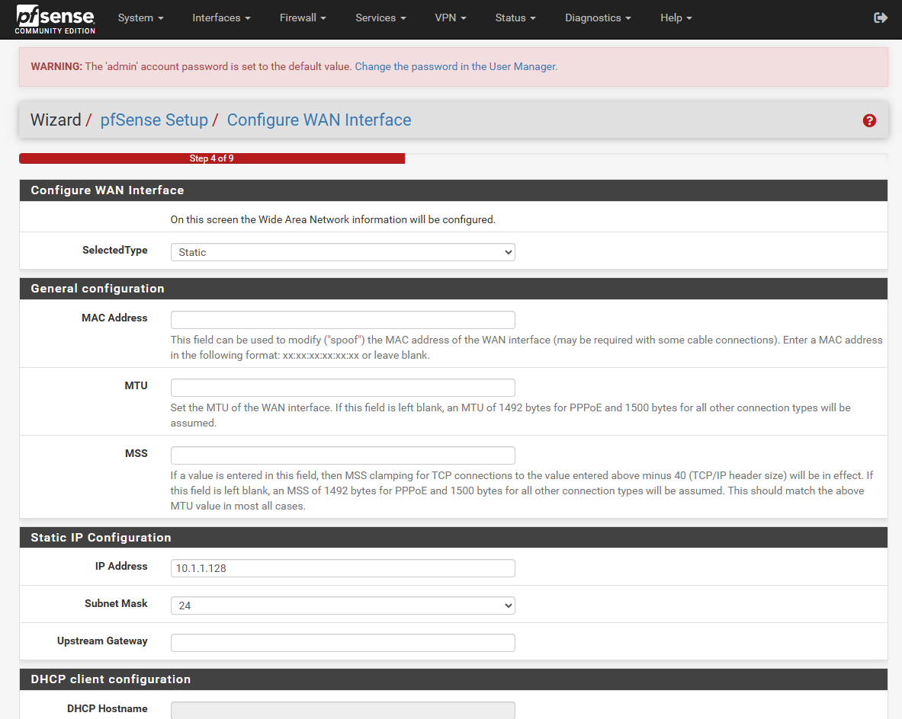

## pfSense:

pfSense is a free, open-source, enterprise-grade firewall and router software distribution **based on FreeBSD**. It provides powerful networking features through an easy-to-use web interface and is widely used in small offices, large enterprises, and home labs.

### Key Features of pfSense
- **Firewall & NAT**: Stateful packet inspection with customizable firewall rules.
- **VPN Support**: Supports OpenVPN, IPsec, WireGuard, and PPTP for secure remote access.
- **Traffic Shaping**: Quality of Service (QoS) for bandwidth management and prioritization.
- **Load Balancing**: Supports multi-WAN failover and load balancing for improved uptime.
- **Captive Portal**: For guest network control with authentication options.
- **Detailed Logging & Reporting**: Real-time monitoring with tools like traffic graphs, logs, and package-based reporting.
- **Package Manager**: Extendable with additional packages like Snort (IDS/IPS), pfBlockerNG (ad and threat blocker), Squid (proxy), and more.
- **Web-Based Management**: Fully configured and managed via a secure web GUI — no command line needed for most tasks.
- **Backup and Restore**: Simple configuration backup and restore system.

### Why Use pfSense?
- **Secure**: Robust firewall with advanced security features.
- **Flexible**: Can be used as firewall, router, VPN gateway, DHCP server, DNS resolver, and more.
- **Reliable**: pfSense is widely used in production environments for years.
- **Cost-Effective**: Free to use (open-source) with optional commercial support from Netgate.
- **Hardware-Friendly**: Runs on low-cost hardware, embedded systems, or virtual machines.

### Prerequisites
- VMware Workstation/ESXi
- CPU: 64-bit amd64 (x86-64) compatible
- RAM: 2 GB or more
- Disk space: 8 GB or larger
- Network interface: At least 02 NICs

### Network Layout:
- One for the WAN interface, set `Bridged` or `NAT`, depending on your network.
- One for the LAN interface, designated `Host-only` to keep it apart from the outside network.

#### Environments:
- WAN IP : 10.1.1.128
- LAN IP : 192.168.1.1

### Install pfSense: 

Virtual environments may have additional requirements, see the following documents for examples:

- Virtualizing with Proxmox® VE
- Virtualizing pfSense Software with Hyper-V
- Virtualizing pfSense Software with VMware vSphere / ESXi

#### Installation Walkthrough:

In this tutorial, I will install pfSense 2.7.0 on a VMware virtual machine. 

  
 Click to expand 

1. First creating the pfSense VMware virtual machine follows the typical new virtual machine wizard.  
Some products require identifying the OS being installed on the VM. The ideal option is **FreeBSD 12 64-bit**. If this is not available, try options like **FreeBSD 12**, or **Other 64-bit** OS. Do not choose a Windows or Linux related OS type.

2. As the PfSense setup starts booting, a prompt is displayed with some options and a countdown timer. At this prompt, **press** `1` for the default installation of PfSense. If we don't choose any option, it will start to boot option `1` by default.

3. On the next screen, you'll be asked to configure the console. Just click `Accept` to move forward with the installation process.

4. Proceed with the `Install` option and select `OK`.

5. Select your keyboard language.

6. Select the **Auto (ZFS)** file system, which is recommended for the FreeBSD architecture, unless you want a customized setup and click `OK`.

7. Next, **select the disk** on which you want to install PfSense. In my case, I am choosing my available dedicated virtual storage on VMware.

8. Wait while the setup extracts the installation files.

9. After completion, setup will give you the option to open a shell to modify your configuration. Select `No` and `proceed`.

10. `Reboot` the machine to get the GUI session of your PfSense installation.

11. After the installation of pfSense completes successfully, the virtual machine will boot into the initial configuration phase of the setup. In this text-only menu-driven interface, you are able to configure the initial network configuration so you have connectivity to the pfSense VM.

12. Access Web Interface: Open a web browser and navigate to `http://your_ip` (or the LAN IP address you configured).

Login with Default Credentials:
- Username: admin
- Password: pfsense

13. This begins the Webconfigurator wizard. Click `Next`.

  

  
  
  
  
  
  
  
  
  

After clicking `Finish`, you are taken to the default pfSense dashboard. You can customize the widgets displayed on this page. At this point, you are ready to begin creating firewall and NAT rules for your environment to start passing traffic.

  

#### pfSense Software Default Configuration

After installation and interface assignment, pfSense software has the following default configuration:

- WAN is configured as an IPv4 DHCP client.
- WAN is configured as an IPv6 DHCP client and will request a prefix delegation.
- LAN is configured with a static IPv4 address of 192.168.1.1/24.
- LAN is configured to use a delegated IPv6 address/prefix obtained by WAN (Track IPv6) if one is available.
- **All incoming connections to WAN are blocked by the firewall**.
- **All outgoing connections from LAN are allowed by the firewall**.
- The firewall performs NAT on IPv4 traffic leaving WAN from the LAN subnet
- The firewall will act as an IPv4 DHCP Server
- The firewall will act as an IPv6 DHCPv6 Server if a prefix delegation was obtained on WAN, and also enables SLAAC
- The DNS Resolver is enabled so the firewall can accept and respond to DNS queries.
- SSH is disabled.
- WebGUI is running on port 443 using HTTPS.
- Default credentials are set as described in Default Username and Password.

### Links:
- [Download Installation Media](https://docs.netgate.com/pfsense/en/latest/install/download-installer-image.html)
- [Installation Walkthrough](https://docs.netgate.com/pfsense/en/latest/install/install-walkthrough.html)
- [Install the PfSense firewall](https://4sysops.com/archives/how-to-install-the-pfsense-firewall-on-a-virtual-machine/)
- [Deploy pfSense on VMware](https://www.virtualizationhowto.com/2022/03/deploy-pfsense-vmware-step-by-step/)
- [pfSense on VMware](https://ahmed86-star.github.io/posts/pfsense-VMware-Setup/)

